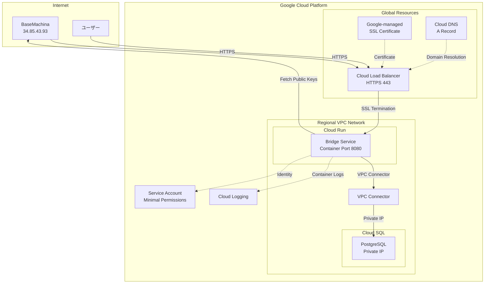
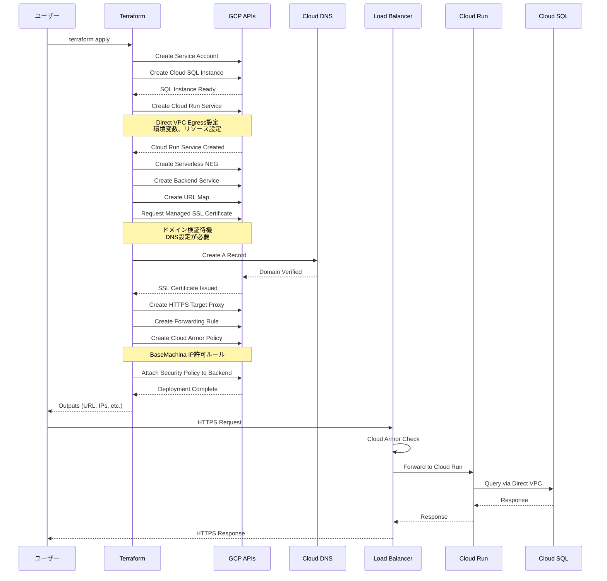
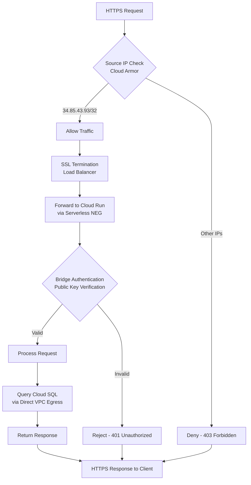

# Technical Design Document

## Overview

このプロジェクトは、Google Cloud RunでBaseMachina bridgeをデプロイするための包括的なTerraformソリューションを提供します。既存のAWS ECS Fargate実装と同様の構造で、再利用可能なTerraformモジュール、実践的なデプロイ例、および自動化されたテストを整備することで、GCPユーザーが迅速かつ確実にBridge環境を構築できるようにします。

**目的**: BaseMachinaのマルチクラウド戦略を実現し、GCPユーザーにAWSと同等の品質とセキュリティを提供します。

**ユーザー**: インフラエンジニア、DevOpsエンジニア、品質保証エンジニアがこのソリューションを利用して、Bridge環境の構築、デプロイ、テストを実施します。

**影響**: 現在のプロジェクト構造に新しいGCPモジュール、example、テストを追加することで、マルチクラウド対応を完成させます。既存のAWS実装には影響を与えません。

### Goals

- Google Cloud Run用の再利用可能なTerraformモジュールを提供し、標準化されたBridgeデプロイを実現する
- Cloud SQL統合とカスタムドメイン設定を含む実践的なexampleを提供する
- Terratestによる自動化されたテストスイートで品質を保証する
- 既存のAWS実装と一貫性のあるプロジェクト構造を維持する

### Non-Goals

- 既存のAWS ECS Fargateモジュールの変更や拡張
- GCP以外のクラウドプロバイダー（Azure、AlibabaCloudなど）への対応
- Cloud Run以外のGCPコンピューティングオプション（GKE、Compute Engineなど）のサポート
- Bridgeコンテナイメージ自体の変更や機能追加

## Architecture

### Existing Architecture Analysis

既存のAWS ECS Fargate実装は以下の構造とパターンを確立しています：

- **機能別ファイル分割パターン**: main.tfを空にし、alb.tf、ecs.tf、iam.tf、logs.tfなど機能別にファイルを分割
- **標準的なTerraform構成**: variables.tf、outputs.tf、versions.tfによる明確な入出力定義
- **セキュリティファースト設計**: IPホワイトリスト、最小権限IAM、VPCエンドポイント
- **包括的なテスト**: Terratestによるエンドツーエンドテスト、HTTPS疎通確認、ヘルスチェック検証

GCP実装では、これらのパターンとアーキテクチャ原則を維持しながら、GCP固有のベストプラクティスを適用します。

### High-Level Architecture



### Technology Alignment

このプロジェクトは既存のTerraformベースのIaCアプローチを踏襲し、以下の技術スタックに準拠します：

**新規導入するGCP技術**:
- **Cloud Run**: フルマネージドコンテナプラットフォーム（ECS Fargateと同等）
- **Cloud Load Balancing**: HTTPS終端とルーティング（ALBと同等）
- **Google-managed SSL Certificate**: 自動SSL証明書管理（ACMと同等）
- **Cloud DNS**: DNS管理（Route53と同等）
- **Serverless VPC Access Connector**: VPCとのプライベート接続
- **Cloud SQL**: マネージドPostgreSQLデータベース（RDSと同等）
- **Cloud Logging**: ログ管理（CloudWatch Logsと同等）

**維持される技術**:
- Terraform >= 1.0
- Terratest（Go言語テストフレームワーク）
- terraform-docs（ドキュメント自動生成）
- tfsec（セキュリティスキャン）

### Key Design Decisions

#### Decision 1: Cloud Load Balancer + Serverless NEGによるIP制限

**Context**: Cloud Runには直接的なIP allowlist機能がないため、BaseMachinaのIPアドレス（34.85.43.93）からのアクセスのみを許可する方法が必要です。

**Alternatives**:
1. Cloud Armor セキュリティポリシー（推奨）
2. Ingress設定を"internal-and-cloud-load-balancing"に設定し、Cloud Load Balancerで制御
3. Identity-Aware Proxy（IAP）による認証ベースのアクセス制御

**Selected Approach**: Ingress設定とCloud Armor セキュリティポリシーの組み合わせ

Cloud Runサービスのingressを"internal-and-cloud-load-balancing"に設定し、Serverless Network Endpoint Group（NEG）を使用してCloud Load Balancerのバックエンドとして構成します。Cloud Armorセキュリティポリシーで、BaseMachinaのIPアドレス（34.85.43.93/32）からのアクセスのみを許可するルールを設定します。

**Rationale**:
- Cloud Armorは強力なレイヤー7ファイアウォール機能を提供し、IPベースのアクセス制御が可能
- Serverless NEGにより、Cloud RunサービスをLoad Balancerのバックエンドとして直接利用可能
- Google-managed SSL証明書との統合が容易
- DDoS保護とトラフィック管理の追加機能を利用可能

**Trade-offs**:
- 利点: 強力なセキュリティ、スケーラビリティ、Google-managed SSL証明書の自動管理
- 欠点: Cloud Armor使用料の追加コスト、設定がやや複雑

#### Decision 2: Direct VPC EgressによるCloud SQL接続

**Context**: Cloud RunからCloud SQLへのプライベートIP接続を確立する必要があります。

**Alternatives**:
1. Serverless VPC Access Connector（従来の方法）
2. Direct VPC Egress（新しい推奨方法、2024年以降）
3. Cloud SQL Auth Proxyによるパブリック接続

**Selected Approach**: Direct VPC Egress

Cloud RunサービスにVPCネットワークを直接関連付け、Direct VPC Egressを使用してCloud SQLのプライベートIPアドレスに接続します。これにより、Serverless VPC Access Connectorを作成する必要がありません。

**Rationale**:
- Googleが2024年に推奨する最新のベストプラクティス
- Serverless VPC Access Connectorのプロビジョニングと管理が不要
- レイテンシの低減とパフォーマンスの向上
- シンプルな構成で運用コストを削減

**Trade-offs**:
- 利点: シンプルな構成、低レイテンシ、コネクタ管理不要、コスト削減
- 欠点: 比較的新しい機能のため、既存ドキュメントやコミュニティサポートが少ない可能性

**注**: 調査の結果、Direct VPC Egressが利用できない環境や、既存のVPC Connectorを再利用したい場合に備えて、Serverless VPC Access Connectorもオプションとしてサポートします。

#### Decision 3: 機能別ファイル分割パターンの採用

**Context**: Terraformモジュールのファイル構成において、可読性と保守性を最大化する必要があります。

**Alternatives**:
1. すべてのリソースをmain.tfに配置（シンプルだが大規模化で可読性低下）
2. 機能別ファイル分割（AWS実装で採用）
3. リソース種別ファイル分割（compute.tf、network.tf、storage.tf）

**Selected Approach**: 機能別ファイル分割パターン

AWS ECS Fargate実装と同様に、以下のファイル構成を採用します：
- main.tf: 空（他ファイルに実装を配置）
- cloud_run.tf: Cloud Runサービス、コンテナ設定
- load_balancer.tf: Cloud Load Balancer、Serverless NEG、URL Map
- security.tf: Cloud Armorセキュリティポリシー、IAMバインディング
- dns.tf: Cloud DNS管理レコード
- variables.tf: 入力変数定義
- outputs.tf: 出力値定義
- versions.tf: プロバイダーバージョン制約

**Rationale**:
- AWS実装との一貫性により、開発者の学習コストを削減
- 機能単位での変更が容易で、コードレビューが効率的
- 関連リソースが同じファイルにまとまり、理解しやすい
- 将来的な機能追加時にファイルを追加するだけで対応可能

**Trade-offs**:
- 利点: 高い可読性、保守性、一貫性、スケーラビリティ
- 欠点: ファイル数が増える、小規模プロジェクトではオーバーエンジニアリングの可能性

## System Flows

### Cloud Run Service Deployment Flow



### HTTPS Traffic Flow with IP Restriction



## Requirements Traceability

| Requirement | 要件概要 | コンポーネント | インターフェース | フロー |
|-------------|---------|--------------|--------------|--------|
| 1.1 | 入力変数定義 | Cloud Run Module | variables.tf | - |
| 1.2 | Cloud Runサービス作成 | Cloud Run Module | google_cloud_run_v2_service | Deployment Flow |
| 1.3 | Bridgeコンテナイメージ使用 | Cloud Run Module | container.image設定 | - |
| 1.4 | Bridge環境変数設定 | Cloud Run Module | container.env設定 | - |
| 1.5 | HTTPS通信とSSL証明書 | Load Balancer Module | google_compute_managed_ssl_certificate | Deployment Flow |
| 1.6 | カスタムドメイン設定 | DNS Module | google_dns_record_set | Deployment Flow |
| 1.7 | 重要な出力値提供 | Cloud Run Module | outputs.tf | - |
| 1.8 | BaseMachina IPアクセス許可 | Security Module | google_compute_security_policy | Traffic Flow |
| 2.1-2.8 | Example実装 | GCP Cloud Run Example | main.tf, rds.tf, dns.tf等 | - |
| 3.1-3.8 | 自動化テスト | Cloud Run Test Suite | cloud_run_test.go | - |
| 4.1-4.8 | プロジェクト構造とドキュメント | Project Structure | modules/gcp/, examples/gcp/, test/gcp/ | - |
| 5.1-5.8 | セキュリティとネットワーク | Security & Network Config | security.tf, cloud_run.tf | Traffic Flow |
| 6.1-6.8 | Terraformベストプラクティス | All Modules | versions.tf, variables.tf, outputs.tf | - |

## Components and Interfaces

### Infrastructure Layer

#### Cloud Run Module

**Responsibility & Boundaries**
- **Primary Responsibility**: Cloud RunサービスとしてBaseMachina bridgeをデプロイし、コンテナ実行環境を管理する
- **Domain Boundary**: GCP Cloud Run、コンテナ設定、環境変数管理
- **Data Ownership**: Cloud Runサービス設定、コンテナ環境変数、リビジョン管理
- **Transaction Boundary**: Cloud Runサービスのライフサイクル管理（作成、更新、削除）

**Dependencies**
- **Inbound**: Load Balancer Module（Serverless NEG経由でトラフィックを受信）
- **Outbound**:
  - Cloud SQL Module（Direct VPC Egress経由でデータベース接続）
  - Cloud Logging（コンテナログ送信）
  - BaseMachina API（認証用公開鍵取得）
- **External**:
  - GitHub Container Registry（ghcr.io/basemachina/bridge）
  - Google Cloud APIs（Cloud Run API、Compute Engine API）

**Contract Definition - Terraform Module Interface**

```hcl
# 入力変数
variable "project_id" {
  description = "GCP Project ID where resources will be created"
  type        = string
}

variable "region" {
  description = "GCP region for Cloud Run service"
  type        = string
  default     = "asia-northeast1"
}

variable "service_name" {
  description = "Name of the Cloud Run service"
  type        = string
  default     = "basemachina-bridge"
}

variable "tenant_id" {
  description = "Tenant ID for authentication"
  type        = string
  sensitive   = true
}

variable "fetch_interval" {
  description = "Interval for fetching public keys (e.g., 1h, 30m)"
  type        = string
  default     = "1h"
}

variable "fetch_timeout" {
  description = "Timeout for fetching public keys (e.g., 10s, 30s)"
  type        = string
  default     = "10s"
}

variable "port" {
  description = "Port number for Bridge container (cannot be 4321)"
  type        = number
  default     = 8080

  validation {
    condition     = var.port != 4321
    error_message = "Port 4321 is not allowed"
  }
}

variable "vpc_connector_id" {
  description = "VPC Access Connector ID for Cloud SQL connection (optional, uses Direct VPC Egress if not specified)"
  type        = string
  default     = null
}

variable "vpc_egress" {
  description = "VPC egress setting (all-traffic or private-ranges-only)"
  type        = string
  default     = "private-ranges-only"

  validation {
    condition     = contains(["all-traffic", "private-ranges-only"], var.vpc_egress)
    error_message = "VPC egress must be either 'all-traffic' or 'private-ranges-only'"
  }
}

variable "cpu" {
  description = "CPU allocation for Cloud Run service (e.g., '1', '2', '4')"
  type        = string
  default     = "1"
}

variable "memory" {
  description = "Memory allocation for Cloud Run service (e.g., '512Mi', '1Gi', '2Gi')"
  type        = string
  default     = "512Mi"
}

variable "min_instances" {
  description = "Minimum number of instances"
  type        = number
  default     = 0
}

variable "max_instances" {
  description = "Maximum number of instances"
  type        = number
  default     = 10
}

variable "labels" {
  description = "Labels to apply to all resources"
  type        = map(string)
  default     = {}
}

# 出力値
output "service_url" {
  description = "Cloud Run service URL"
  value       = google_cloud_run_v2_service.bridge.uri
}

output "service_name" {
  description = "Cloud Run service name"
  value       = google_cloud_run_v2_service.bridge.name
}

output "service_id" {
  description = "Cloud Run service ID"
  value       = google_cloud_run_v2_service.bridge.id
}

output "service_account_email" {
  description = "Service account email used by Cloud Run"
  value       = google_service_account.bridge.email
}

output "bridge_image_uri" {
  description = "Bridge container image URI used by Cloud Run service"
  value       = "ghcr.io/basemachina/bridge:latest"
}
```

**Preconditions**:
- GCP Project IDが有効であり、Cloud Run APIが有効化されていること
- tenant_idが設定されていること
- VPC Connectorを使用する場合、事前に作成されていること

**Postconditions**:
- Cloud Runサービスが指定されたリージョンにデプロイされ、実行可能状態になること
- 環境変数が正しく設定され、Bridgeが認証機能を実行できること
- サービスアカウントが作成され、必要最小限の権限が付与されていること
- Direct VPC EgressまたはVPC Connector経由でVPCネットワークにアクセス可能であること

**Invariants**:
- portは常に4321以外の値であること
- vpc_egressは"all-traffic"または"private-ranges-only"のいずれかであること
- 環境変数TENANT_IDは常にセンシティブとして扱われること

#### Load Balancer Module

**Responsibility & Boundaries**
- **Primary Responsibility**: HTTPS終端、SSL証明書管理、トラフィックルーティングを提供し、Cloud RunサービスへのセキュアなHTTPSアクセスを実現する
- **Domain Boundary**: GCP Cloud Load Balancing、Google-managed SSL Certificate、Serverless NEG
- **Data Ownership**: Load Balancer設定、SSL証明書、URL Map、フォワーディングルール
- **Transaction Boundary**: Load Balancerとそのコンポーネント（Backend Service、URL Map、Target Proxy、Forwarding Rule）のライフサイクル管理

**Dependencies**
- **Inbound**: インターネットからのHTTPSトラフィック
- **Outbound**:
  - Cloud Run Module（Serverless NEG経由でリクエスト転送）
  - Cloud DNS Module（ドメイン名解決）
- **External**: Google-managed SSL Certificate（自動発行・更新）

**Contract Definition - Terraform Module Interface**

```hcl
# 入力変数
variable "cloud_run_service_name" {
  description = "Cloud Run service name for backend"
  type        = string
}

variable "cloud_run_region" {
  description = "Cloud Run service region"
  type        = string
}

variable "domain_name" {
  description = "Custom domain name for the Bridge (e.g., bridge.example.com)"
  type        = string
}

variable "enable_https_redirect" {
  description = "Enable HTTP to HTTPS redirect"
  type        = bool
  default     = true
}

variable "enable_cloud_armor" {
  description = "Enable Cloud Armor security policy"
  type        = bool
  default     = true
}

variable "allowed_ip_ranges" {
  description = "IP ranges allowed to access the service (BaseMachina IP is always included)"
  type        = list(string)
  default     = ["34.85.43.93/32"]
}

# 出力値
output "load_balancer_ip" {
  description = "Load balancer external IP address"
  value       = google_compute_global_address.default.address
}

output "ssl_certificate_id" {
  description = "Managed SSL certificate ID"
  value       = google_compute_managed_ssl_certificate.default.id
}

output "backend_service_id" {
  description = "Backend service ID"
  value       = google_compute_backend_service.default.id
}

output "url_map_id" {
  description = "URL map ID"
  value       = google_compute_url_map.default.id
}
```

**Preconditions**:
- domain_nameが有効なドメイン名であること
- Cloud Runサービスが既にデプロイされていること
- ドメインのDNSレコードがLoad BalancerのIPアドレスを指していること（SSL証明書発行のため）

**Postconditions**:
- Load BalancerがグローバルIPアドレスで公開され、HTTPSトラフィックを受け付けること
- Google-managed SSL証明書が自動発行され、HTTPSが有効化されること
- Serverless NEGがCloud Runサービスをバックエンドとして構成されること
- Cloud Armorセキュリティポリシーが適用され、許可されたIPアドレスのみアクセス可能であること

**Invariants**:
- allowed_ip_rangesには常にBaseMachinaのIPアドレス（34.85.43.93/32）が含まれること
- enable_https_redirectがtrueの場合、HTTPトラフィックは常にHTTPSにリダイレクトされること

#### Security Module

**Responsibility & Boundaries**
- **Primary Responsibility**: Cloud Armorセキュリティポリシーを管理し、IPベースのアクセス制御を実現する
- **Domain Boundary**: Cloud Armor、IAM、セキュリティポリシー
- **Data Ownership**: セキュリティポリシールール、IAMバインディング
- **Transaction Boundary**: セキュリティポリシーのライフサイクル管理

**Dependencies**
- **Inbound**: Load Balancer Module（セキュリティポリシー適用）
- **Outbound**: なし
- **External**: Cloud Armor API

**Contract Definition - Terraform Module Interface**

```hcl
# 入力変数
variable "allowed_ip_ranges" {
  description = "IP ranges allowed to access the service"
  type        = list(string)
  default     = ["34.85.43.93/32"]
}

variable "policy_name" {
  description = "Name of the Cloud Armor security policy"
  type        = string
  default     = "basemachina-bridge-policy"
}

# 出力値
output "security_policy_id" {
  description = "Cloud Armor security policy ID"
  value       = google_compute_security_policy.default.id
}

output "service_account_email" {
  description = "Service account email for Cloud Run"
  value       = google_service_account.bridge.email
}
```

**Preconditions**:
- allowed_ip_rangesが有効なCIDR形式のIPアドレス範囲であること

**Postconditions**:
- Cloud Armorセキュリティポリシーが作成され、指定されたIPアドレス範囲のみアクセスを許可すること
- それ以外のIPアドレスからのアクセスは403 Forbiddenで拒否されること
- サービスアカウントが作成され、最小権限の原則に従った権限が付与されること

**Invariants**:
- allowed_ip_rangesは常に空でないこと（少なくともBaseMachinaのIPアドレスが含まれる）

#### DNS Module

**Responsibility & Boundaries**
- **Primary Responsibility**: Cloud DNSでAレコードを管理し、カスタムドメインからLoad BalancerへのDNS解決を実現する
- **Domain Boundary**: Cloud DNS、DNSレコード管理
- **Data Ownership**: DNSレコード設定
- **Transaction Boundary**: DNSレコードのライフサイクル管理

**Dependencies**
- **Inbound**: ドメイン名解決リクエスト
- **Outbound**: Load Balancer Module（IPアドレス参照）
- **External**: Cloud DNS API

**Contract Definition - Terraform Module Interface**

```hcl
# 入力変数
variable "dns_zone_name" {
  description = "Cloud DNS managed zone name"
  type        = string
}

variable "domain_name" {
  description = "Domain name for the A record"
  type        = string
}

variable "load_balancer_ip" {
  description = "Load balancer IP address"
  type        = string
}

# 出力値
output "dns_record_name" {
  description = "DNS record name"
  value       = google_dns_record_set.bridge.name
}

output "dns_record_type" {
  description = "DNS record type"
  value       = google_dns_record_set.bridge.type
}
```

**Preconditions**:
- dns_zone_nameが既存のCloud DNS Managed Zoneを指していること
- domain_nameがManaged Zoneのドメインと一致すること

**Postconditions**:
- Aレコードが作成され、domain_nameがload_balancer_ipに解決されること
- SSL証明書のドメイン検証が完了可能な状態になること

**Invariants**:
- DNSレコードタイプは常に"A"であること

### Example Layer

#### GCP Cloud Run Example

**Responsibility & Boundaries**
- **Primary Responsibility**: Cloud Runモジュールの使用方法を示す実践的なデプロイ例を提供する
- **Domain Boundary**: Example実装、Cloud SQL統合、カスタムドメイン設定
- **Data Ownership**: Example設定、terraform.tfvars.example、README.md
- **Transaction Boundary**: Exampleのデプロイとクリーンアップ

**Dependencies**
- **Inbound**: ユーザー（Terraform操作）
- **Outbound**:
  - Cloud Run Module
  - Cloud SQL Module
  - Load Balancer Module
  - DNS Module
- **External**: なし

**Contract Definition - Example Configuration**

```hcl
# main.tf
module "basemachina_bridge" {
  source = "../../modules/gcp/cloud-run"

  project_id   = var.project_id
  region       = var.region
  service_name = var.service_name

  tenant_id      = var.tenant_id
  fetch_interval = var.fetch_interval
  fetch_timeout  = var.fetch_timeout
  port           = var.port

  cpu           = var.cpu
  memory        = var.memory
  min_instances = var.min_instances
  max_instances = var.max_instances

  labels = var.labels
}

# cloud_sql.tf
resource "google_sql_database_instance" "main" {
  name             = "${var.service_name}-db"
  database_version = "POSTGRES_15"
  region           = var.region

  settings {
    tier = "db-f1-micro"

    ip_configuration {
      ipv4_enabled    = false
      private_network = var.vpc_network_id
    }
  }
}

# dns.tf
module "dns" {
  source = "../../modules/gcp/dns"

  dns_zone_name     = var.dns_zone_name
  domain_name       = var.domain_name
  load_balancer_ip  = module.load_balancer.load_balancer_ip
}

# load_balancer.tf
module "load_balancer" {
  source = "../../modules/gcp/load-balancer"

  cloud_run_service_name = module.basemachina_bridge.service_name
  cloud_run_region       = var.region
  domain_name            = var.domain_name
  enable_https_redirect  = true
  enable_cloud_armor     = true
  allowed_ip_ranges      = ["34.85.43.93/32"]
}
```

### Test Layer

#### Cloud Run Test Suite

**Responsibility & Boundaries**
- **Primary Responsibility**: Cloud RunモジュールとExampleの正常動作を検証する自動テストを提供する
- **Domain Boundary**: Terratest、統合テスト、HTTPS検証、Cloud SQL接続テスト
- **Data Ownership**: テストコード、テスト設定、検証ロジック
- **Transaction Boundary**: テストのセットアップ、実行、クリーンアップ

**Dependencies**
- **Inbound**: テスト実行トリガー（go test）
- **Outbound**:
  - GCP APIs（リソース作成・検証・削除）
  - Cloud Run Example
- **External**:
  - Terratest library
  - Go testing framework

**Contract Definition - Test Interface**

```go
// TestCloudRunModule tests the Cloud Run module deployment
func TestCloudRunModule(t *testing.T) {
    t.Parallel()

    // 環境変数からテスト設定を取得
    projectID := mustGetenv(t, "TEST_PROJECT_ID")
    region := mustGetenv(t, "TEST_REGION")
    tenantID := mustGetenv(t, "TEST_TENANT_ID")
    domainName := mustGetenv(t, "TEST_DOMAIN_NAME")
    dnsZoneName := mustGetenv(t, "TEST_DNS_ZONE_NAME")

    // Terraform設定
    terraformOptions := &terraform.Options{
        TerraformDir: "../../examples/gcp-cloud-run",
        Vars: map[string]interface{}{
            "project_id":    projectID,
            "region":        region,
            "tenant_id":     tenantID,
            "domain_name":   domainName,
            "dns_zone_name": dnsZoneName,
        },
    }

    defer terraform.Destroy(t, terraformOptions)
    terraform.InitAndApply(t, terraformOptions)

    // 出力値取得
    serviceURL := terraform.Output(t, terraformOptions, "service_url")
    loadBalancerIP := terraform.Output(t, terraformOptions, "load_balancer_ip")

    // HTTPS疎通確認
    testHTTPSAccess(t, serviceURL)

    // ヘルスチェックエンドポイント確認
    testHealthCheck(t, serviceURL)

    // Cloud SQL接続確認
    testCloudSQLConnection(t, terraformOptions)

    // DNS解決確認
    testDNSResolution(t, domainName, loadBalancerIP)

    // SSL証明書確認
    testSSLCertificate(t, domainName)
}

// testHTTPSAccess verifies HTTPS access to the Bridge
func testHTTPSAccess(t *testing.T, serviceURL string) {
    resp, err := http.Get(serviceURL + "/ok")
    require.NoError(t, err)
    defer resp.Body.Close()
    assert.Equal(t, http.StatusOK, resp.StatusCode)
}

// testHealthCheck verifies the /ok endpoint returns successfully
func testHealthCheck(t *testing.T, serviceURL string) {
    resp, err := http.Get(serviceURL + "/ok")
    require.NoError(t, err)
    defer resp.Body.Close()

    body, err := io.ReadAll(resp.Body)
    require.NoError(t, err)
    assert.Contains(t, string(body), "ok")
}

// testCloudSQLConnection verifies Cloud SQL connection from Bridge
func testCloudSQLConnection(t *testing.T, terraformOptions *terraform.Options) {
    // Cloud SQLインスタンス名取得
    sqlInstanceName := terraform.Output(t, terraformOptions, "sql_instance_name")

    // Cloud SQL接続確認（ログから検証）
    // 実装の詳細はテストフェーズで決定
}

// testDNSResolution verifies DNS A record resolution
func testDNSResolution(t *testing.T, domainName string, expectedIP string) {
    // DNS解決確認
    // 実装の詳細はテストフェーズで決定
}

// testSSLCertificate verifies SSL certificate is valid
func testSSLCertificate(t *testing.T, domainName string) {
    // SSL証明書検証
    // 実装の詳細はテストフェーズで決定
}
```

**Preconditions**:
- テスト環境変数が正しく設定されていること
- GCPプロジェクトにテスト実行権限があること
- DNS Managed Zoneが事前に作成されていること

**Postconditions**:
- すべてのテストが成功した場合、リソースが正常にデプロイされ、期待通りに動作すること
- テスト完了後、すべてのリソースがクリーンアップされること
- テスト失敗時は詳細なエラーメッセージが出力されること

**Invariants**:
- テストは常に独立して実行可能であること（t.Parallel()使用）
- terraform.Destroyは常に実行されること（deferによる保証）

## Data Models

### Physical Data Model

#### Cloud Run Service Configuration

```hcl
resource "google_cloud_run_v2_service" "bridge" {
  name     = var.service_name
  location = var.region
  ingress  = "INGRESS_TRAFFIC_INTERNAL_LOAD_BALANCER"

  template {
    containers {
      image = "ghcr.io/basemachina/bridge:latest"

      env {
        name  = "FETCH_INTERVAL"
        value = var.fetch_interval
      }
      env {
        name  = "FETCH_TIMEOUT"
        value = var.fetch_timeout
      }
      env {
        name  = "PORT"
        value = tostring(var.port)
      }
      env {
        name  = "TENANT_ID"
        value = var.tenant_id
      }

      resources {
        limits = {
          cpu    = var.cpu
          memory = var.memory
        }
      }

      ports {
        container_port = var.port
      }
    }

    scaling {
      min_instance_count = var.min_instances
      max_instance_count = var.max_instances
    }

    vpc_access {
      egress = var.vpc_egress
      network_interfaces {
        network    = var.vpc_network_id
        subnetwork = var.vpc_subnetwork_id
      }
    }

    service_account = google_service_account.bridge.email
  }

  labels = var.labels
}
```

#### Cloud SQL Instance Configuration

```hcl
resource "google_sql_database_instance" "main" {
  name             = "${var.service_name}-db"
  database_version = "POSTGRES_15"
  region           = var.region

  settings {
    tier = var.db_tier

    ip_configuration {
      ipv4_enabled    = false
      private_network = var.vpc_network_id

      authorized_networks {
        name  = "basemachina"
        value = "34.85.43.93/32"
      }
    }

    backup_configuration {
      enabled            = true
      start_time         = "03:00"
      point_in_time_recovery_enabled = true
    }
  }

  deletion_protection = var.deletion_protection
}

resource "google_sql_database" "default" {
  name     = var.database_name
  instance = google_sql_database_instance.main.name
}

resource "google_sql_user" "default" {
  name     = var.database_user
  instance = google_sql_database_instance.main.name
  password = var.database_password
}
```

#### Load Balancer Configuration

```hcl
# Serverless NEG
resource "google_compute_region_network_endpoint_group" "cloud_run_neg" {
  name                  = "${var.service_name}-neg"
  network_endpoint_type = "SERVERLESS"
  region                = var.region

  cloud_run {
    service = var.cloud_run_service_name
  }
}

# Backend Service
resource "google_compute_backend_service" "default" {
  name                  = "${var.service_name}-backend"
  protocol              = "HTTPS"
  port_name             = "http"
  timeout_sec           = 30
  enable_cdn            = false

  backend {
    group = google_compute_region_network_endpoint_group.cloud_run_neg.id
  }

  security_policy = var.enable_cloud_armor ? google_compute_security_policy.default[0].id : null
}

# URL Map
resource "google_compute_url_map" "default" {
  name            = "${var.service_name}-url-map"
  default_service = google_compute_backend_service.default.id
}

# Managed SSL Certificate
resource "google_compute_managed_ssl_certificate" "default" {
  name = "${var.service_name}-cert"

  managed {
    domains = [var.domain_name]
  }
}

# HTTPS Target Proxy
resource "google_compute_target_https_proxy" "default" {
  name             = "${var.service_name}-https-proxy"
  url_map          = google_compute_url_map.default.id
  ssl_certificates = [google_compute_managed_ssl_certificate.default.id]
}

# Global Forwarding Rule (HTTPS)
resource "google_compute_global_forwarding_rule" "https" {
  name       = "${var.service_name}-https-rule"
  target     = google_compute_target_https_proxy.default.id
  port_range = "443"
  ip_address = google_compute_global_address.default.address
}

# HTTP to HTTPS Redirect (Optional)
resource "google_compute_url_map" "https_redirect" {
  count = var.enable_https_redirect ? 1 : 0
  name  = "${var.service_name}-https-redirect"

  default_url_redirect {
    https_redirect         = true
    redirect_response_code = "MOVED_PERMANENTLY_DEFAULT"
    strip_query            = false
  }
}
```

#### Cloud Armor Security Policy

```hcl
resource "google_compute_security_policy" "default" {
  count = var.enable_cloud_armor ? 1 : 0
  name  = var.policy_name

  # BaseMachinaからのアクセスを許可
  rule {
    action   = "allow"
    priority = 1000
    match {
      versioned_expr = "SRC_IPS_V1"
      config {
        src_ip_ranges = var.allowed_ip_ranges
      }
    }
    description = "Allow access from BaseMachina and additional IPs"
  }

  # デフォルトで拒否
  rule {
    action   = "deny(403)"
    priority = 2147483647
    match {
      versioned_expr = "SRC_IPS_V1"
      config {
        src_ip_ranges = ["*"]
      }
    }
    description = "Default deny rule"
  }
}
```

### Data Contracts & Integration

#### Environment Variables Schema

Bridgeコンテナに渡される環境変数：

| 変数名 | 型 | 必須 | デフォルト | 検証ルール | 説明 |
|--------|---|------|-----------|----------|------|
| FETCH_INTERVAL | string | Yes | 1h | duration形式（ns/us/ms/s/m/h） | 公開鍵更新間隔 |
| FETCH_TIMEOUT | string | Yes | 10s | duration形式（ns/us/ms/s/m/h） | 公開鍵更新タイムアウト |
| PORT | string | Yes | 8080 | 1-65535、4321以外 | コンテナポート |
| TENANT_ID | string | Yes | - | 空文字列不可 | テナントID |

#### Output Schema

モジュールから出力される値：

```typescript
interface ModuleOutputs {
  // Cloud Run
  service_url: string;           // Cloud RunサービスURL
  service_name: string;          // サービス名
  service_id: string;            // サービスID
  service_account_email: string; // サービスアカウントメール
  bridge_image_uri: string;      // 使用されているBridgeコンテナイメージURI

  // Load Balancer
  load_balancer_ip: string;      // グローバルIPアドレス
  ssl_certificate_id: string;    // SSL証明書ID
  backend_service_id: string;    // バックエンドサービスID

  // DNS
  dns_record_name: string;       // DNSレコード名
  domain_name: string;           // ドメイン名

  // Cloud SQL
  sql_instance_name: string;     // Cloud SQLインスタンス名
  sql_instance_connection_name: string; // 接続名
  sql_private_ip: string;        // プライベートIPアドレス

  // Security
  security_policy_id: string;    // Cloud ArmorポリシーID
}
```

## Error Handling

### Error Strategy

GCP Terraformモジュールでは、以下のエラー処理戦略を採用します：

1. **入力検証**: variable validationブロックで事前にエラーを防ぐ
2. **依存関係管理**: depends_onとimplicit dependenciesで正しいリソース作成順序を保証
3. **リトライ機能**: Terraformの自動リトライメカニズムを活用
4. **エラーメッセージ**: 明確で実行可能なエラーメッセージを提供
5. **ロールバック**: terraform destroyで完全なクリーンアップを保証

### Error Categories and Responses

#### User Errors (入力エラー)

**Invalid input - 変数検証エラー**:
```hcl
variable "port" {
  validation {
    condition     = var.port != 4321
    error_message = "Port 4321 is not allowed. Please use a different port number."
  }
}
```
対応: 明確なエラーメッセージで修正方法を提示

**Missing required configuration - 必須設定の欠落**:
```hcl
variable "tenant_id" {
  description = "Tenant ID for authentication (required)"
  type        = string
  sensitive   = true
}
```
対応: Terraform実行時に必須変数が未設定の場合エラー

**Invalid domain configuration - ドメイン設定エラー**:
- DNS Managed Zoneが存在しない
- ドメイン名がManaged Zoneと一致しない

対応: 事前条件チェックとエラーメッセージで解決方法を案内

#### System Errors (インフラエラー)

**API quota exceeded - APIクォータ超過**:
対応: Terraformの自動リトライ、エラーメッセージでクォータ増加を案内

**Network connectivity issues - ネットワーク接続エラー**:
対応: GCP APIへの接続エラーを検出し、ネットワーク設定の確認を促す

**Resource creation timeout - リソース作成タイムアウト**:
対応: terraform applyのtimeout設定で適切な待機時間を設定

**SSL certificate provisioning failure - SSL証明書発行失敗**:
```hcl
resource "google_compute_managed_ssl_certificate" "default" {
  # DNS A recordが正しく設定されていることを確認
  depends_on = [google_dns_record_set.bridge]
}
```
対応: DNS設定の確認を促し、証明書発行の前提条件を明示

#### Business Logic Errors (ビジネスロジックエラー)

**Incompatible configuration - 非互換設定**:
- VPC ConnectorとDirect VPC Egressの同時指定
- 無効なリージョンとゾーンの組み合わせ

対応: variable validationで事前検証、エラーメッセージで修正方法を提示

**Resource dependency conflict - リソース依存関係の競合**:
対応: depends_onとlifecycleブロックで依存関係を明示的に管理

### Monitoring

#### Error Tracking

- **Terraform State**: エラー発生時のステート情報を保持
- **Cloud Logging**: Cloud Runコンテナのエラーログを集約
- **Cloud Monitoring**: アラートポリシーで異常検知

#### Logging

```hcl
# Cloud Runサービスのログ
resource "google_logging_project_sink" "cloud_run_logs" {
  name        = "${var.service_name}-logs"
  destination = "storage.googleapis.com/${google_storage_bucket.logs.name}"
  filter      = "resource.type=cloud_run_revision AND resource.labels.service_name=${var.service_name}"
}
```

#### Health Monitoring

- **Cloud Run Health Checks**: `/ok`エンドポイントの定期的な監視
- **Load Balancer Health Checks**: バックエンドサービスのヘルスステータス確認
- **Uptime Checks**: 外部からのHTTPS疎通確認

## Testing Strategy

### Unit Tests

Terraformモジュールの単体テストでは、以下の項目を検証します：

1. **変数検証ロジック**: invalid inputに対するvalidationブロックの動作確認
2. **出力値の型と形式**: 出力値が期待される型と形式で返されることを確認
3. **リソース命名規則**: 生成されるリソース名が命名規則に従っていることを確認
4. **デフォルト値の適用**: 変数のデフォルト値が正しく適用されることを確認

### Integration Tests

モジュール間の連携を検証する統合テストでは、以下の項目を検証します：

1. **Cloud RunとLoad Balancerの統合**: Serverless NEG経由のトラフィック転送
2. **Cloud RunとCloud SQLの統合**: Direct VPC Egress経由のデータベース接続
3. **Load BalancerとCloud DNSの統合**: ドメイン名解決とSSL証明書発行
4. **Cloud ArmorとLoad Balancerの統合**: IPベースのアクセス制御

### E2E Tests

エンドツーエンドテストでは、以下のシナリオを検証します：

1. **完全なデプロイフロー**: terraform initからapplyまでのエラーなし実行
2. **HTTPS疎通確認**: BaseMachinaのIPアドレスからのHTTPSアクセス成功
3. **ヘルスチェック確認**: `/ok`エンドポイントへのアクセスが200 OKを返す
4. **Cloud SQL接続確認**: BridgeからCloud SQLへのクエリ実行成功
5. **DNS解決確認**: カスタムドメインがLoad BalancerのIPアドレスに解決される
6. **SSL証明書確認**: HTTPS接続でSSL証明書が有効であることを確認
7. **IP制限確認**: 許可されていないIPアドレスからのアクセスが403で拒否される
8. **完全なクリーンアップ**: terraform destroyですべてのリソースが削除される

### Performance/Load Tests

パフォーマンステストでは、以下の項目を検証します：

1. **同時接続数**: Cloud Runのオートスケーリング動作確認（max_instancesまでスケール）
2. **レスポンスタイム**: 通常負荷下でのレスポンスタイムが許容範囲内（< 1秒）
3. **Cloud SQLコネクション数**: 高負荷時のデータベースコネクション管理
4. **Load Balancerスループット**: Cloud Load BalancerのHTTPSスループット確認

## Security Considerations

### Threat Modeling

主要な脅威とその対策：

1. **不正アクセス**: Cloud Armorによるソース IP制限でBaseMachina以外のアクセスをブロック
2. **中間者攻撃（MITM）**: Google-managed SSL証明書によるHTTPS通信の強制
3. **データ漏洩**: Cloud SQLのプライベートIP接続により、データベースをインターネットから隔離
4. **過剰な権限**: サービスアカウントに最小権限の原則を適用（Cloud Run Invoker、Cloud SQL Client、Log Writerのみ）
5. **機密情報の露出**: TENANT_IDをsensitiveとして扱い、Terraformの状態ファイルで暗号化

### Authentication and Authorization

#### Cloud Run Service Account

```hcl
resource "google_service_account" "bridge" {
  account_id   = "${var.service_name}-sa"
  display_name = "Service Account for BaseMachina Bridge"
}

# Cloud SQL Client権限
resource "google_project_iam_member" "cloud_sql_client" {
  project = var.project_id
  role    = "roles/cloudsql.client"
  member  = "serviceAccount:${google_service_account.bridge.email}"
}

# Cloud Logging書き込み権限
resource "google_project_iam_member" "log_writer" {
  project = var.project_id
  role    = "roles/logging.logWriter"
  member  = "serviceAccount:${google_service_account.bridge.email}"
}
```

> **Note**: BridgeはSecret Managerを使用しないため、`roles/secretmanager.secretAccessor` 権限は不要です。

### Data Protection and Privacy

1. **転送中のデータ**: HTTPS通信による暗号化（TLS 1.2以上）
2. **保存データ**: Cloud SQLの自動暗号化（Google-managed encryption keys）
3. **ログデータ**: Cloud Loggingでの自動暗号化とアクセス制御
4. **プライベートネットワーク**: Cloud SQLへのプライベートIP接続

### Compliance Requirements

- **最小権限の原則**: IAMロールは必要最小限に制限
- **監査ログ**: Cloud Auditログで全API操作を記録
- **データレジデンシー**: リージョン指定によるデータ保存場所の制御
- **暗号化標準**: Google Cloud推奨の暗号化方式を使用

## Performance & Scalability

### Target Metrics

- **レスポンスタイム**: 通常負荷で < 500ms、P95で < 1秒
- **スループット**: 100リクエスト/秒以上（単一インスタンス）
- **可用性**: 99.95%以上（Cloud Runの標準SLA）
- **スケーリング時間**: 需要増加から30秒以内に新インスタンス起動

### Scaling Approaches

#### Horizontal Scaling

Cloud Runの自動スケーリング設定：

```hcl
scaling {
  min_instance_count = var.min_instances  # 0 or 1（コールドスタート許容度に応じて）
  max_instance_count = var.max_instances  # 10-100（予想負荷に応じて）
}
```

- **スケールアウト**: リクエスト数増加に応じて自動的にインスタンス追加
- **スケールイン**: トラフィック減少時に自動的にインスタンス削減
- **コールドスタート対策**: min_instances=1でウォームインスタンスを維持

#### Vertical Scaling

リソース設定の調整：

```hcl
resources {
  limits = {
    cpu    = var.cpu     # "1", "2", "4"（計算負荷に応じて）
    memory = var.memory  # "512Mi", "1Gi", "2Gi"（メモリ使用量に応じて）
  }
}
```

### Caching Strategies

1. **Cloud Load Balancerキャッシュ**: 静的コンテンツのエッジキャッシング（必要に応じて有効化）
2. **Cloud SQLコネクションプーリング**: データベース接続の再利用でオーバーヘッド削減
3. **Cloud CDN**: グローバル配信が必要な場合に有効化

### Optimization Techniques

1. **Direct VPC Egress**: Serverless VPC Access Connectorを使用せず、レイテンシを最小化
2. **リージョン選択**: ユーザーに近いリージョンでデプロイしてレイテンシを削減
3. **HTTP/2サポート**: Cloud Load BalancerのHTTP/2でパフォーマンス向上
4. **コンテナイメージ最適化**: 軽量なBridgeイメージでコールドスタート時間を短縮
