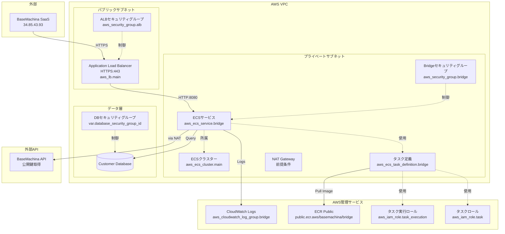
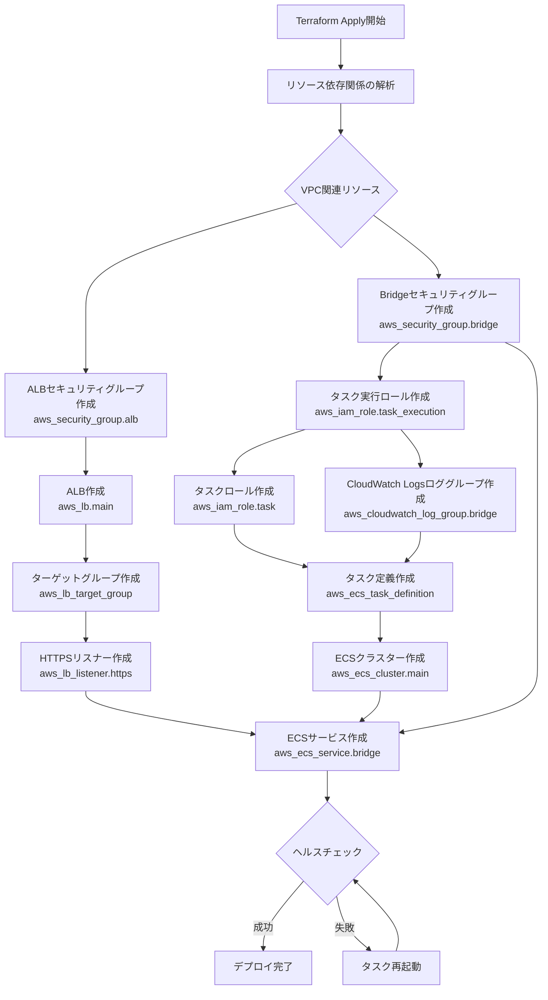
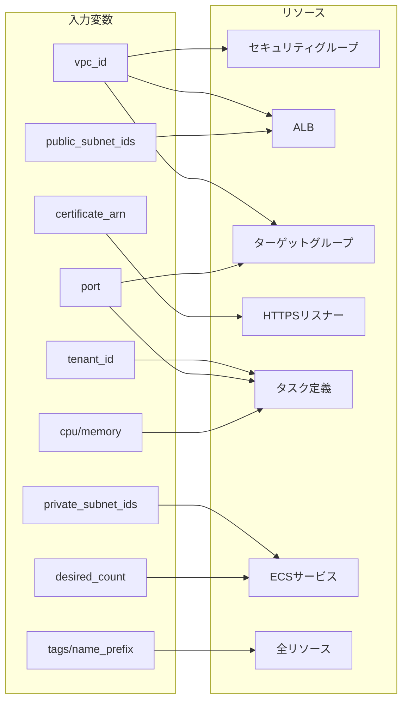

# 技術設計ドキュメント

## Overview

本設計は、`modules/aws/ecs-fargate/main.tf`の実装を通じて、ECS Fargate Bridgeモジュールを完全に機能させることを目的としています。現在、main.tfは空の状態であり、`outputs.tf`で参照されているリソース（ALB、ECS、セキュリティグループなど）が未定義のため、exampleのデプロイもテストの実行もできません。

この実装により、モジュールユーザーは最小限の変数設定でBridge環境全体をデプロイでき、Terratestによる統合テストが実行可能になります。また、既存の機能別ファイル（alb.tf、ecs.tf、iam.tf、logs.tf、security_groups.tf）を活用し、保守性の高い実装を実現します。

### Goals

- **outputs.tfとの整合性**: outputs.tfで参照されている全リソース（10個）を適切に定義し、エラーのないモジュール実行を実現
- **機能別ファイルへの実装**: 既存の構造（alb.tf、ecs.tf等）に沿ってリソース定義を追加し、main.tfを空のまま維持
- **Example簡略化**: モジュール呼び出しだけで完全なインフラがデプロイされ、セットアップ手順を最小限に
- **テスト実行可能化**: Terratestがapply、ヘルスチェック、出力値検証まで完全に実行可能
- **variables.tfとの整合**: 既存の全変数が適切にリソース定義で使用され、未使用の変数が存在しない

### Non-Goals

- **新しいファイルの作成**: 機能別ファイルが既に存在するため、main.tfに実装を追加せず、既存ファイルを使用
- **モジュール構造の変更**: ディレクトリ構成やファイル命名規則の変更は行わない
- **新機能の追加**: Requirement以外の機能（例: 自動スケーリング、カスタムメトリクス）は追加しない
- **VPCインフラの作成**: 既存のVPC、サブネット、NATゲートウェイを前提とする
- **証明書管理の自動化**: ACM証明書は事前に作成され、ARNとして提供されることを前提

## Architecture

### Existing Architecture Analysis

**現在のモジュール構造**:
```
modules/aws/ecs-fargate/
├── main.tf                 # 空（コメントのみ）
├── variables.tf            # 完全に定義済み（16変数）
├── outputs.tf              # 完全に定義済み（10出力値、未定義リソースを参照）
├── versions.tf             # 完全に定義済み（Terraform 1.0+、AWS Provider 5.0+）
├── alb.tf                  # 空（今回実装対象）
├── ecs.tf                  # 空（今回実装対象）
├── iam.tf                  # 空（今回実装対象）
├── logs.tf                 # 空（今回実装対象）
└── security_groups.tf      # 空（今回実装対象）
```

**既存のドメイン境界**:
- ネットワーク層: ALB、セキュリティグループ（alb.tf、security_groups.tf）
- コンピューティング層: ECSクラスター、サービス、タスク定義（ecs.tf）
- 権限管理層: IAMロール、ポリシー（iam.tf）
- 監視層: CloudWatch Logs（logs.tf）

**保持すべき統合ポイント**:
- outputs.tfの参照整合性: 全てのoutputが正しいリソース名とパスを参照
- variables.tfの使用: 全ての変数が適切にリソース定義で使用される
- ファイル分割パターン: steering/structure.mdに定義された機能別ファイル分割ルールに準拠

### High-Level Architecture



### Architecture Integration

**既存パターンの保持**:
- **ファイル分割パターン**: structure.mdで定義された機能別ファイル分割（alb.tf、ecs.tf、iam.tf、logs.tf、security_groups.tf）
- **リソース命名規則**: `${var.name_prefix}-basemachina-bridge`のパターンを使用
- **タグ戦略**: `var.tags`を全リソースに適用し、一貫したタグ付けを実現
- **セキュリティベストプラクティス**: プライベートサブネット配置、最小権限IAM、HTTPS通信

**新規コンポーネントの根拠**:
このspecでは既存のアーキテクチャに新しいコンポーネントを追加するのではなく、設計済みのコンポーネントを実装します。

**技術スタックの整合性**:
- Terraform 1.0以上、AWS Provider 5.0以上（versions.tfで定義済み）
- 既存の変数定義とoutput定義を変更せず、リソース定義のみを追加

**ステアリング準拠**:
- **モジュール化原則**: 単一責任（Bridge on ECS Fargate）、明確な入出力インターフェース
- **Infrastructure as Code原則**: 冪等性、宣言的、バージョン管理
- **セキュリティファースト**: 最小権限IAM、暗号化通信、ネットワーク分離

## Technology Stack and Design Decisions

### Technology Alignment

本実装は既存システムの拡張であり、新しい技術スタックの導入は行いません。

**既存の技術スタックとの整合**:
- **Terraform**: プロジェクト標準のIaCツール（versions.tfで1.0以上を要求）
- **AWS Provider (~> 5.0)**: 既存のプロバイダーバージョン制約に準拠
- **標準モジュール構造**: 既存のファイル構成（alb.tf、ecs.tf、iam.tf、logs.tf、security_groups.tf）を活用

**新規導入される依存関係**:
- なし（全てのリソースはAWS標準サービス）

**パターンからの逸脱**:
- なし

### Key Design Decisions

#### Decision 1: main.tfを空のまま維持し、機能別ファイルに実装

**Context**: 既存のモジュール構造には、機能別にファイルが分割されている（alb.tf、ecs.tf、iam.tf、logs.tf、security_groups.tf）。main.tfは現在空の状態で、これらのファイルも空である。

**Alternatives**:
- **main.tfに全実装を集約**: 全てのリソース定義をmain.tfに記述し、他のファイルを削除
- **機能別ファイルを削除して単一ファイル化**: alb.tf等を削除し、main.tfのみで管理
- **一部を統合**: 関連性の高いリソース（例: ECSとIAM）を同じファイルにまとめる

**Selected Approach**: 既存の機能別ファイル（alb.tf、ecs.tf、iam.tf、logs.tf、security_groups.tf）にリソース定義を追加し、main.tfは空のまま維持

この設計では、各ファイルが以下のリソースを持ちます:
- **alb.tf**: `aws_lb.main`、`aws_lb_target_group`、`aws_lb_listener`
- **ecs.tf**: `aws_ecs_cluster.main`、`aws_ecs_service.bridge`、`aws_ecs_task_definition`
- **security_groups.tf**: `aws_security_group.alb`、`aws_security_group.bridge`、データベース接続用ルール
- **iam.tf**: `aws_iam_role.task_execution`、`aws_iam_role.task`、ポリシーアタッチメント
- **logs.tf**: `aws_cloudwatch_log_group.bridge`

**Rationale**:
- **既存構造の尊重**: structure.mdで明示的に定義された機能別ファイル分割パターンに準拠
- **保守性の向上**: 各ファイルが明確な責任境界を持ち、変更の影響範囲が限定される
- **可読性**: 100行を超えるmain.tfよりも、20-40行の機能別ファイルの方が理解しやすい
- **既存プロジェクトとの一貫性**: aws-ecs-fargate-bridgeの実装済みモジュールでも同様のファイル分割が使用されている

**Trade-offs**:
- **獲得**: 高い可読性、明確な責任分離、変更の影響範囲の限定、既存パターンへの準拠
- **犠牲**: ファイル数の増加（5ファイル）、ファイル間の参照関係の理解が必要

#### Decision 2: outputs.tfで参照されているリソース名を厳守

**Context**: outputs.tfは既に完全に定義されており、特定のリソース名を参照している（例: `aws_lb.main`、`aws_ecs_cluster.main`、`aws_ecs_service.bridge`）。

**Alternatives**:
- **outputs.tfを変更**: リソース名を自由に決定し、outputs.tfを更新する
- **リソース名を変更**: より説明的な名前（例: `aws_lb.basemachina_bridge_alb`）を使用し、outputs.tfを更新
- **エイリアス化**: 内部で異なる名前を使い、`locals`でエイリアスを作成

**Selected Approach**: outputs.tfで参照されているリソース名を完全に維持

以下のリソース名を厳守します:
- `aws_lb.main`
- `aws_security_group.alb`
- `aws_ecs_cluster.main`
- `aws_ecs_service.bridge`
- `aws_security_group.bridge`
- `aws_cloudwatch_log_group.bridge`
- `aws_iam_role.task_execution`
- `aws_iam_role.task`

**Rationale**:
- **既存のAPIコントラクトの維持**: モジュールの出力値は公開APIであり、変更するとモジュールユーザーに影響
- **最小変更の原則**: outputs.tfは既に正しく設計されており、変更の必要性がない
- **テストの整合性**: test/aws/ecs_fargate_test.goがこれらの出力値を参照しているため、変更は不要
- **ドキュメントとの整合**: README等で出力値が既に文書化されている可能性

**Trade-offs**:
- **獲得**: 既存のAPIコントラクトの維持、変更の影響範囲の最小化、テストとの整合性
- **犠牲**: リソース名の自由度が制限される（ただし、現在の名前は適切に設計されている）

#### Decision 3: データベース接続設定をモジュール外に委譲

**Context**: Bridgeはデータベースやその他のリソースに接続する必要があるが、接続先のリソースはユースケースごとに異なる（RDS、内部API、外部サービス等）。

**Alternatives**:
- **モジュール内で接続設定**: `database_security_group_id`と`database_port`変数を受け取り、モジュール内でセキュリティグループルールを作成
- **複数の接続先変数**: RDS、API、その他のサービス用に個別の変数を用意
- **動的ブロック**: 接続先のリストを変数で受け取り、動的にルールを作成
- **モジュール外に委譲**: モジュールは`bridge_security_group_id`を出力し、ユーザーが接続先のルールを自分で追加

**Selected Approach**: モジュール外に委譲（`bridge_security_group_id`出力値の提供）

モジュールは`bridge_security_group_id`を出力し、ユーザーが以下のようにセキュリティグループルールを追加します:
```hcl
resource "aws_security_group_rule" "bridge_to_rds" {
  type                     = "ingress"
  from_port                = 5432
  to_port                  = 5432
  protocol                 = "tcp"
  source_security_group_id = module.basemachina_bridge.bridge_security_group_id
  security_group_id        = var.rds_security_group_id
  description              = "Allow Bridge to access RDS"
}
```

**Rationale**:
- **柔軟性の最大化**: ユーザーが任意の数の接続先を自由に設定可能
- **単一責任の原則**: モジュールはBridge環境の構築のみに集中し、接続先の設定は対象外
- **シンプルなモジュールAPI**: 変数の数を削減し、モジュールの使いやすさを向上
- **予測可能な動作**: モジュール内で条件付きリソース作成を行わないため、動作が明確

**Trade-offs**:
- **獲得**: モジュールのシンプル化、柔軟性、明確な責任分離
- **犠牲**: ユーザーが最低1つのセキュリティグループルールを自分で追加する必要がある（ただし、これはユーザーの制御力を高める）

## System Flows

### リソース作成フロー



### 変数からリソースへのマッピングフロー



## Requirements Traceability

| Requirement | 概要 | 実装ファイル | リソース |
|-------------|------|-------------|---------|
| 1.1-1.4 | ファイル構造の整理 | alb.tf, ecs.tf, iam.tf, logs.tf, security_groups.tf | - |
| 2.1-2.9 | ECSクラスターとサービス | ecs.tf | aws_ecs_cluster.main, aws_ecs_service.bridge |
| 3.1-3.9 | ECSタスク定義 | ecs.tf | aws_ecs_task_definition |
| 4.1-4.14 | ALB | alb.tf | aws_lb.main, aws_lb_target_group, aws_lb_listener |
| 5.1-5.9 | セキュリティグループ | security_groups.tf | aws_security_group.alb, aws_security_group.bridge |
| 6.1-6.7 | IAMロール | iam.tf | aws_iam_role.task_execution, aws_iam_role.task |
| 7.1-7.4 | CloudWatch Logs | logs.tf | aws_cloudwatch_log_group.bridge |
| 8.1-8.10 | outputs.tfとの整合性 | 全ファイル | 全リソース |
| 9.1-9.5 | Exampleの簡略化 | - | - |
| 10.1-10.5 | テストの実行可能化 | - | - |
| 11.1-11.3 | variables.tfとの整合性 | 全ファイル | 全リソース |
| 12.1-12.3 | オプション変数のハンドリング | alb.tf | 条件付きリソース |

## Components and Interfaces

### Infrastructure Layer

#### ALBコンポーネント (alb.tf)

**Responsibility & Boundaries**
- **Primary Responsibility**: HTTPS終端、トラフィックルーティング、ヘルスチェック
- **Domain Boundary**: ネットワーク層 - 外部トラフィックの受信とBridgeへの転送
- **Data Ownership**: ALBメトリクス、アクセスログ
- **Transaction Boundary**: 個々のHTTPリクエスト・レスポンス

**Dependencies**
- **Inbound**: BaseMachina SaaS（34.85.43.93からのHTTPSリクエスト）
- **Outbound**: ALBセキュリティグループ、パブリックサブネット、ACM証明書
- **External**: AWS Certificate Manager (ACM)

**Contract Definition**

**Terraform Resource Interface**:
```hcl
# Application Load Balancer
resource "aws_lb" "main" {
  name               = "${var.name_prefix}basemachina-bridge"
  internal           = false
  load_balancer_type = "application"
  security_groups    = [aws_security_group.alb.id]
  subnets            = var.public_subnet_ids

  tags = merge(var.tags, {
    Name = "${var.name_prefix}basemachina-bridge"
  })
}

# ターゲットグループ
resource "aws_lb_target_group" "bridge" {
  name        = "${var.name_prefix}bridge-tg"
  port        = var.port
  protocol    = "HTTP"
  target_type = "ip"
  vpc_id      = var.vpc_id

  health_check {
    enabled             = true
    healthy_threshold   = 2
    unhealthy_threshold = 2
    timeout             = 5
    interval            = 30
    path                = "/ok"
    protocol            = "HTTP"
    matcher             = "200"
  }

  tags = var.tags
}

# HTTPSリスナー
resource "aws_lb_listener" "https" {
  load_balancer_arn = aws_lb.main.arn
  port              = "443"
  protocol          = "HTTPS"
  ssl_policy        = "ELBSecurityPolicy-TLS13-1-2-2021-06"
  certificate_arn   = var.certificate_arn

  default_action {
    type             = "forward"
    target_group_arn = aws_lb_target_group.bridge.arn
  }
}
```

- **Preconditions**: パブリックサブネット、ALBセキュリティグループ、ACM証明書が存在
- **Postconditions**: ALBがACTIVE状態、HTTPS:443でリクエスト受信可能
- **Invariants**: HTTPS通信はTLS 1.3または1.2で暗号化される

#### ECSコンポーネント (ecs.tf)

**Responsibility & Boundaries**
- **Primary Responsibility**: Fargateタスクの実行、ライフサイクル管理、スケーリング
- **Domain Boundary**: コンピューティング層 - Bridgeコンテナの実行環境
- **Data Ownership**: クラスター状態、サービス状態、タスク実行履歴
- **Transaction Boundary**: タスクの起動・停止

**Dependencies**
- **Inbound**: ECSサービス（ユーザー変数経由）
- **Outbound**: ECSクラスター、タスク定義、IAMロール、CloudWatch Logs、プライベートサブネット、Bridgeセキュリティグループ
- **External**: public.ecr.aws/basemachina/bridge コンテナイメージ

**External Dependencies Investigation**:

**Bridge Container Image** (`public.ecr.aws/basemachina/bridge`):
- **レジストリ**: Amazon ECR Public（認証不要）
- **イメージタグ**: `latest`（本番環境では特定バージョンタグの使用を推奨）
- **ポート**: 8080（環境変数`PORT`でカスタマイズ可能）
- **ヘルスチェックエンドポイント**: `/ok` (HTTP GET)
- **必須環境変数**:
  - `FETCH_INTERVAL`: 公開鍵更新間隔（例: `1h`）
  - `FETCH_TIMEOUT`: 公開鍵取得タイムアウト（例: `10s`）
  - `PORT`: リスニングポート（例: `8080`）
  - `TENANT_ID`: テナントID
- **認証メカニズム**: JWT Bearer Token検証、BaseMachina APIから公開鍵を取得
- **ログ出力**: stdout/stderr

**Contract Definition**

**Terraform Resource Interface**:
```hcl
# ECSクラスター
resource "aws_ecs_cluster" "main" {
  name = "${var.name_prefix}basemachina-bridge"

  setting {
    name  = "containerInsights"
    value = "enabled"
  }

  tags = merge(var.tags, {
    Name = "${var.name_prefix}basemachina-bridge"
  })
}

# タスク定義
resource "aws_ecs_task_definition" "bridge" {
  family                   = "${var.name_prefix}basemachina-bridge"
  network_mode             = "awsvpc"
  requires_compatibilities = ["FARGATE"]
  cpu                      = var.cpu
  memory                   = var.memory
  execution_role_arn       = aws_iam_role.task_execution.arn

  container_definitions = jsonencode([
    {
      name  = "bridge"
      image = "public.ecr.aws/basemachina/bridge:latest"

      portMappings = [
        {
          containerPort = var.port
          protocol      = "tcp"
        }
      ]

      environment = [
        { name = "FETCH_INTERVAL", value = var.fetch_interval },
        { name = "FETCH_TIMEOUT", value = var.fetch_timeout },
        { name = "PORT", value = tostring(var.port) },
        { name = "TENANT_ID", value = var.tenant_id }
      ]

      logConfiguration = {
        logDriver = "awslogs"
        options = {
          "awslogs-group"         = aws_cloudwatch_log_group.bridge.name
          "awslogs-region"        = data.aws_region.current.name
          "awslogs-stream-prefix" = "bridge"
        }
      }
    }
  ])

  tags = var.tags
}

# ECSサービス
resource "aws_ecs_service" "bridge" {
  name            = "${var.name_prefix}basemachina-bridge"
  cluster         = aws_ecs_cluster.main.id
  task_definition = aws_ecs_task_definition.bridge.arn
  desired_count   = var.desired_count
  launch_type     = "FARGATE"

  network_configuration {
    subnets          = var.private_subnet_ids
    security_groups  = [aws_security_group.bridge.id]
    assign_public_ip = var.assign_public_ip
  }

  load_balancer {
    target_group_arn = aws_lb_target_group.bridge.arn
    container_name   = "bridge"
    container_port   = var.port
  }

  depends_on = [aws_lb_listener.https]

  tags = var.tags
}

# データソース（リージョン取得用）
data "aws_region" "current" {}
```

- **Preconditions**: IAMロール、CloudWatch Logsロググループ、ALBターゲットグループ、HTTPSリスナーが作成済み
- **Postconditions**: desired_count分のタスクが起動し、ALBターゲットグループに登録される
- **Invariants**: 実行中のタスク数はdesired_countに収束する

#### セキュリティグループコンポーネント (security_groups.tf)

**Responsibility & Boundaries**
- **Primary Responsibility**: ネットワークレベルのアクセス制御
- **Domain Boundary**: ネットワークセキュリティ層
- **Data Ownership**: セキュリティグループルール
- **Transaction Boundary**: 該当なし（ステートフルファイアウォール）

**Dependencies**
- **Inbound**: ALB、Bridgeタスク
- **Outbound**: VPC
- **External**: なし

**Contract Definition**

**Terraform Resource Interface**:
```hcl
# ALBセキュリティグループ
resource "aws_security_group" "alb" {
  name_prefix = "${var.name_prefix}alb-"
  description = "Security group for BaseMachina Bridge ALB"
  vpc_id      = var.vpc_id

  ingress {
    description = "HTTPS from BaseMachina"
    from_port   = 443
    to_port     = 443
    protocol    = "tcp"
    cidr_blocks = ["34.85.43.93/32"]
  }

  egress {
    description = "All outbound traffic"
    from_port   = 0
    to_port     = 0
    protocol    = "-1"
    cidr_blocks = ["0.0.0.0/0"]
  }

  tags = merge(var.tags, {
    Name = "${var.name_prefix}alb"
  })
}

# Bridgeセキュリティグループ
resource "aws_security_group" "bridge" {
  name_prefix = "${var.name_prefix}bridge-"
  description = "Security group for BaseMachina Bridge tasks"
  vpc_id      = var.vpc_id

  ingress {
    description     = "HTTP from ALB"
    from_port       = var.port
    to_port         = var.port
    protocol        = "tcp"
    security_groups = [aws_security_group.alb.id]
  }

  egress {
    description = "All outbound traffic"
    from_port   = 0
    to_port     = 0
    protocol    = "-1"
    cidr_blocks = ["0.0.0.0/0"]
  }

  tags = merge(var.tags, {
    Name = "${var.name_prefix}bridge"
  })
}
```

**モジュールユーザーによる接続設定**:
モジュールは`bridge_security_group_id`を出力し、ユーザーが接続先リソース（RDS、API等）のセキュリティグループルールを追加します。

例（exampleディレクトリのコメントとして提供）:
```hcl
# 例: RDSへの接続を許可
resource "aws_security_group_rule" "bridge_to_rds" {
  type                     = "ingress"
  from_port                = 5432
  to_port                  = 5432
  protocol                 = "tcp"
  source_security_group_id = module.basemachina_bridge.bridge_security_group_id
  security_group_id        = var.rds_security_group_id
  description              = "Allow Bridge to access RDS"
}
```

- **Preconditions**: VPCが存在
- **Postconditions**: セキュリティグループが作成され、指定されたルールが適用される
- **Invariants**: ステートフルファイアウォールとして、確立された接続の戻りトラフィックは自動許可

#### IAMコンポーネント (iam.tf)

**Responsibility & Boundaries**
- **Primary Responsibility**: タスク実行とアプリケーションの権限管理
- **Domain Boundary**: 権限管理層
- **Data Ownership**: IAMロールメタデータ、ポリシー
- **Transaction Boundary**: 該当なし（権限チェックは各API呼び出し時）

**Dependencies**
- **Inbound**: ECS Service（タスク起動時）、Bridgeコンテナ（AWS SDK使用時）
- **Outbound**: ECR、CloudWatch Logs
- **External**: AWS管理ポリシー（`AmazonECSTaskExecutionRolePolicy`）

**Contract Definition**

**Terraform Resource Interface**:
```hcl
# タスク実行ロール
resource "aws_iam_role" "task_execution" {
  name_prefix = "${var.name_prefix}bridge-execution-"

  assume_role_policy = jsonencode({
    Version = "2012-10-17"
    Statement = [
      {
        Action = "sts:AssumeRole"
        Effect = "Allow"
        Principal = {
          Service = "ecs-tasks.amazonaws.com"
        }
      }
    ]
  })

  tags = var.tags
}

# タスク実行ロールのポリシーアタッチ
resource "aws_iam_role_policy_attachment" "task_execution" {
  role       = aws_iam_role.task_execution.name
  policy_arn = "arn:aws:iam::aws:policy/service-role/AmazonECSTaskExecutionRolePolicy"
}

# CloudWatch Logs書き込み権限
resource "aws_iam_role_policy" "cloudwatch_logs" {
  name = "cloudwatch-logs"
  role = aws_iam_role.task_execution.id

  policy = jsonencode({
    Version = "2012-10-17"
    Statement = [
      {
        Effect = "Allow"
        Action = [
          "logs:CreateLogStream",
          "logs:PutLogEvents"
        ]
        Resource = "${aws_cloudwatch_log_group.bridge.arn}:*"
      }
    ]
  })
}

# タスクロール
resource "aws_iam_role" "task" {
  name_prefix = "${var.name_prefix}bridge-task-"

  assume_role_policy = jsonencode({
    Version = "2012-10-17"
    Statement = [
      {
        Action = "sts:AssumeRole"
        Effect = "Allow"
        Principal = {
          Service = "ecs-tasks.amazonaws.com"
        }
      }
    ]
  })

  tags = var.tags
}
```

- **Preconditions**: なし
- **Postconditions**: ロールが作成され、必要なポリシーがアタッチされる
- **Invariants**: `ecs-tasks.amazonaws.com`のみがこのロールをAssumeできる

#### CloudWatch Logsコンポーネント (logs.tf)

**Responsibility & Boundaries**
- **Primary Responsibility**: Bridgeコンテナのログ集約と保存
- **Domain Boundary**: 監視・観測層
- **Data Ownership**: ログストリーム、ログイベント
- **Transaction Boundary**: ログイベントの書き込み（非同期、ベストエフォート）

**Dependencies**
- **Inbound**: Bridgeコンテナ（awslogsドライバー経由）
- **Outbound**: なし
- **External**: なし

**Contract Definition**

**Terraform Resource Interface**:
```hcl
resource "aws_cloudwatch_log_group" "bridge" {
  name              = "/ecs/${var.name_prefix}basemachina-bridge"
  retention_in_days = var.log_retention_days

  tags = var.tags
}
```

- **Preconditions**: なし
- **Postconditions**: ロググループが作成され、指定された保持期間でログが保存される
- **Invariants**: ログイベントは時系列順に保存される

## Data Models

本モジュールはインフラストラクチャプロビジョニングを目的としており、アプリケーションレベルのデータモデルは定義しません。Terraformリソースとしてのデータ構造は、variables.tfとoutputs.tfで定義されています。

### Terraform Input Variables Schema

既存の`variables.tf`で定義されている全14変数を使用します:

| 変数名 | 型 | 必須 | デフォルト | 使用リソース |
|--------|-----|------|-----------|-------------|
| `vpc_id` | string | Yes | - | セキュリティグループ、ターゲットグループ |
| `private_subnet_ids` | list(string) | Yes | - | ECSサービス |
| `public_subnet_ids` | list(string) | Yes | - | ALB |
| `certificate_arn` | string | No | null | HTTPSリスナー |
| `fetch_interval` | string | No | "1h" | タスク定義環境変数 |
| `fetch_timeout` | string | No | "10s" | タスク定義環境変数 |
| `port` | number | No | 8080 | タスク定義、ターゲットグループ、セキュリティグループ |
| `tenant_id` | string | Yes | - | タスク定義環境変数 |
| `cpu` | number | No | 256 | タスク定義 |
| `memory` | number | No | 512 | タスク定義 |
| `desired_count` | number | No | 1 | ECSサービス |
| `assign_public_ip` | bool | No | false | ECSサービス |
| `log_retention_days` | number | No | 7 | CloudWatch Logsロググループ |
| `tags` | map(string) | No | {} | 全リソース |
| `name_prefix` | string | No | "" | 全リソース名 |

### Terraform Output Values Schema

既存の`outputs.tf`で定義されている全10出力値を使用します:

| 出力名 | 説明 | 参照リソース |
|--------|------|-------------|
| `alb_dns_name` | ALBのDNS名 | `aws_lb.main.dns_name` |
| `alb_arn` | ALBのARN | `aws_lb.main.arn` |
| `alb_security_group_id` | ALBセキュリティグループID | `aws_security_group.alb.id` |
| `ecs_cluster_name` | ECSクラスター名 | `aws_ecs_cluster.main.name` |
| `ecs_cluster_arn` | ECSクラスターARN | `aws_ecs_cluster.main.arn` |
| `ecs_service_name` | ECSサービス名 | `aws_ecs_service.bridge.name` |
| `bridge_security_group_id` | BridgeセキュリティグループID | `aws_security_group.bridge.id` |
| `cloudwatch_log_group_name` | CloudWatch Logsロググループ名 | `aws_cloudwatch_log_group.bridge.name` |
| `task_execution_role_arn` | タスク実行ロールARN | `aws_iam_role.task_execution.arn` |

## Error Handling

### Error Strategy

**Terraformレベルのエラーハンドリング**:
- **変数バリデーション**: `validation`ブロックで無効な入力を事前に検出（variables.tfで既に定義済み）
- **依存関係の明示**: `depends_on`により、リソース作成順序を保証
- **リソース命名の衝突回避**: `name_prefix`引数を使用

**ランタイムエラーハンドリング**:
- **ヘルスチェック失敗**: ALBが非200レスポンスを検出し、トラフィックを停止
- **コンテナクラッシュ**: ECS Serviceが自動的に新しいタスクを起動
- **認証エラー**: BridgeがHTTP 401を返し、不正なリクエストを拒否

### Error Categories and Responses

#### User Errors (Terraform実行時)

**Invalid Input**:
- **エラー例**: `port = 4321`、`desired_count = 0`、空のサブネットリスト
- **レスポンス**: Terraform planでバリデーションエラーを表示し、applyを中止
- **ガイダンス**: エラーメッセージに修正方法を明示

**Missing Required Variables**:
- **エラー例**: `vpc_id`、`tenant_id`未指定
- **レスポンス**: "variable X is required"エラーメッセージ
- **ガイダンス**: 必須変数の一覧をREADME.mdに明記

**Invalid Resource References**:
- **エラー例**: 存在しないVPC ID、無効な証明書ARN
- **レスポンス**: Terraform applyでAWS APIエラー
- **ガイダンス**: 変数の説明に正しい形式と前提条件を記載

#### System Errors (AWS Infrastructure)

**Resource Creation Failures**:
- **エラー例**: サービスクォータ超過、IAM権限不足、リソース名衝突
- **レスポンス**: Terraform applyが失敗し、エラーメッセージを表示
- **回復戦略**: クォータ引き上げ、IAM権限追加、名前変更後に再apply

**Fargate Task Launch Failures**:
- **エラー例**: ECRイメージpull失敗、リソース不足、ネットワーク設定エラー
- **レスポンス**: ECS Serviceがタスク起動を再試行
- **回復戦略**: CloudWatch Logsでエラーを確認し、原因を特定

**ALB Health Check Failures**:
- **エラー例**: `/ok`エンドポイント応答なし、タイムアウト、非200レスポンス
- **レスポンス**: 2回連続失敗後、ターゲットをunhealthyとマーク
- **回復戦略**: ECS Serviceが自動的に新しいタスクを起動

#### Business Logic Errors (Bridge Runtime)

**Authentication Failures**:
- **エラー例**: 無効なJWTトークン、期限切れトークン、テナントID不一致
- **レスポンス**: BridgeがHTTP 401を返す
- **ガイダンス**: クライアント側で有効なトークンを再取得

**Public Key Fetch Failures**:
- **エラー例**: BaseMachina API接続失敗、タイムアウト
- **レスポンス**: Bridgeがエラーログを出力し、次の`FETCH_INTERVAL`で再試行
- **回復戦略**: キャッシュされた公開鍵を一時使用（Bridgeの実装に依存）

**Database Connection Failures**:
- **エラー例**: データベース接続タイムアウト、認証エラー
- **レスポンス**: BridgeがHTTP 500を返す
- **回復戦略**: データベース接続設定を確認し、修正

### Monitoring

**Infrastructure Monitoring (CloudWatch)**:
- **ECS Metrics**: CPUUtilization、MemoryUtilization、DesiredTaskCount、RunningTaskCount
- **ALB Metrics**: TargetResponseTime、HealthyHostCount、UnhealthyHostCount、HTTPCode_Target_5XX_Count
- **Logs**: CloudWatch Logsで`/ecs/${var.name_prefix}basemachina-bridge`ロググループを監視

**Alerting** (推奨):
- UnhealthyHostCount > 0 が5分間継続
- HTTPCode_Target_5XX_Count > 閾値
- ECS Service RunningTaskCount < DesiredTaskCount

## Testing Strategy

### Unit Tests (Terraform Validation)

- **`terraform fmt`**: コードフォーマットの検証
- **`terraform validate`**: Terraform構文の検証
- **Variable Validationブロック**: 入力変数のバリデーションロジックをテスト
  - `port != 4321`
  - `desired_count >= 1`
  - サブネットリストが空でない

### Integration Tests (Terratest)

**テストケース** (`test/aws/ecs_fargate_test.go`):
- モジュールが正常にapplyされ、全リソースが作成される
- ALBのDNS名が出力される
- ECS Serviceがdesired_countのタスクを実行している
- ALBのヘルスチェックがhealthyである
- 全10出力値が取得可能である

**クリーンアップ**: テスト後に`terraform destroy`で全リソースを削除

### E2E Tests (Manual or Automated)

- **ALBへのHTTPSリクエスト**: curlでALBのDNS名にHTTPSリクエストを送信
  - 有効なJWTトークンでHTTP 200が返ることを確認
  - 無効なトークンでHTTP 401が返ることを確認
- **ヘルスチェックエンドポイント**: `/ok`エンドポイントがHTTP 200を返すことを確認
- **ログ確認**: CloudWatch Logsで正常なリクエストログとエラーログを確認
- **データベース接続**: Bridgeがデータベースにクエリを実行し、正しい結果を返すことを確認

### Performance/Load Tests

- **同時接続数**: Apache BenchまたはLocustで100〜1000 req/sの負荷をかける
- **レスポンス時間**: P50、P95、P99レスポンス時間を測定
- **スケーリング**: `desired_count`を増やした場合のパフォーマンス向上を検証
- **ヘルスチェック耐性**: 一部のタスクを手動停止し、ALBが自動的にトラフィックをrouteすることを確認

## Security Considerations

### Threat Modeling

**攻撃面の分析**:
- **インターネット向けALB**: 34.85.43.93以外からのアクセスをセキュリティグループで遮断
- **Bridgeコンテナ**: プライベートサブネット配置により、直接のインターネットアクセスを防止
- **IAMロール**: 最小権限の原則に基づき、必要な権限のみを付与

**主要な脅威と緩和策**:
1. **不正アクセス**: ALBセキュリティグループで34.85.43.93/32のみを許可
2. **認証バイパス**: Bridge側でJWT検証を実施
3. **DDoS攻撃**: AWS Shield Standard（自動有効）
4. **データ漏洩**: CloudWatch Logsのアクセス制御
5. **IAM権限の悪用**: タスク実行ロールとタスクロールを分離

### Security Controls

**Network Security**:
- プライベートサブネット配置
- セキュリティグループによるアクセス制御
- NAT経由のアウトバウンド通信

**Data Protection**:
- HTTPS通信（TLS 1.3/1.2）を強制
- CloudWatch LogsはAWS管理のKMSキーで暗号化
- `tenant_id`は`sensitive = true`でマスク

**Access Control**:
- IAMロールベースのアクセス
- 最小権限の原則

**Compliance**:
- AWS Well-Architected Frameworkに準拠
- CloudWatch LogsとAWS CloudTrailで監査ログを記録

### Authentication and Authorization

**Bridge Authentication Flow**:
1. BaseMachinaがHTTPSリクエストにJWT Bearer Tokenを含めて送信
2. ALBがHTTPSを終端し、HTTPリクエストをBridgeにフォワード
3. BridgeがBaseMachina APIから公開鍵を取得
4. BridgeがJWTトークンを検証（署名、有効期限、テナントID）
5. 検証成功時、データベースクエリを実行し結果を返す
6. 検証失敗時、HTTP 401を返す

**Authorization Model**:
- テナント分離: `TENANT_ID`環境変数により、特定のテナントからのリクエストのみを受け付け

## Performance & Scalability

### Target Metrics

- **レスポンス時間**: P95 < 500ms（ALBからBridgeまで）
- **スループット**: 単一タスクあたり100 req/s
- **可用性**: 99.9%

### Scaling Approaches

**水平スケーリング**:
- 手動: `desired_count`を増やし、`terraform apply`を実行
- 自動（将来的な拡張）: ECS Service Auto Scaling

**垂直スケーリング**:
- `cpu`と`memory`を増やし、`terraform apply`を実行

### Caching Strategies

**公開鍵のキャッシング**:
- Bridgeが`FETCH_INTERVAL`ごとにBaseMachina APIから公開鍵を取得
- キャッシュ期間中はローカルで検証
